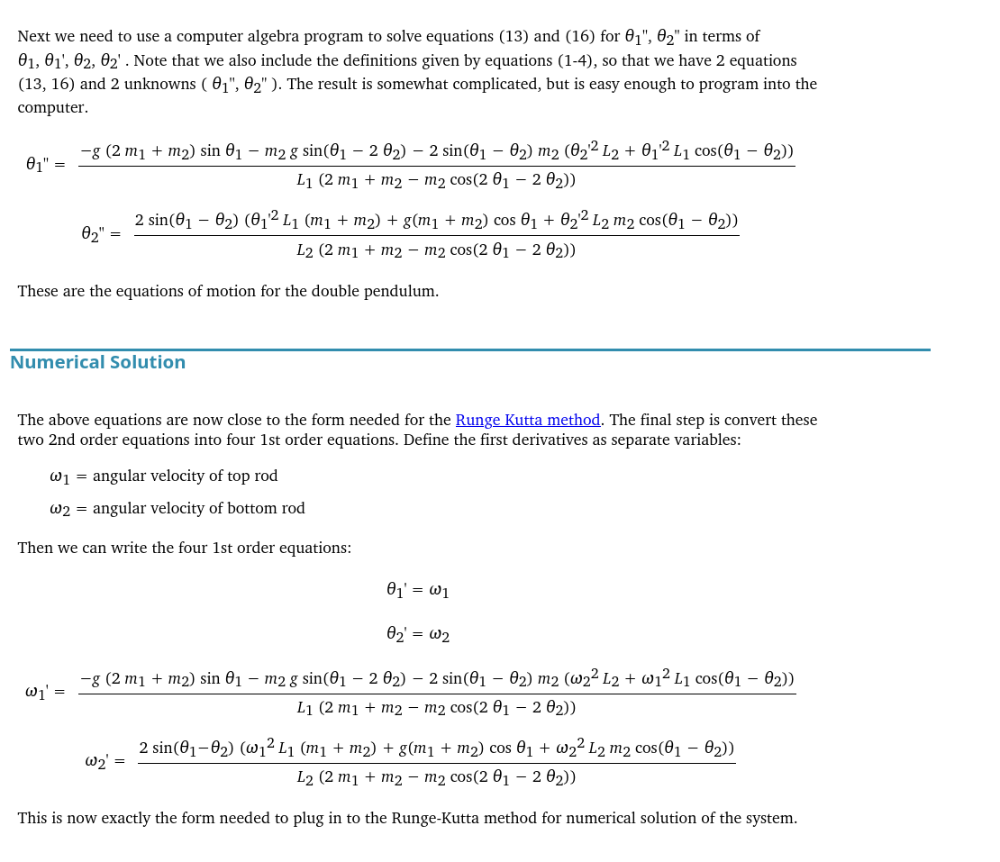

<div align="center">
    <video src="https://github.com/user-attachments/assets/d0842082-f240-4b72-938e-9f8cf8e4bda7" width="360" height="240" controls autoplay loop>
        Your browser does not support the video tag.
    </video>
</div>

# Double Pendulum

A real-time simulation of a double pendulum built with C++ and [raylib](https://www.raylib.com/). For large angles the system is chaotic; for small angles it behaves like a linear oscillator. The trajectory of the lower mass is traced in red to reveal the complex, non-repeating motion.

## Physics

The rods are massless and rigid, the bobs are point masses. The equations of motion are derived using Newton's second law ([source](https://web.mit.edu/jorloff/www/chaosTalk/double-pendulum/double-pendulum-en.html)):



The two second-order ODEs are converted into four first-order ODEs by defining angular velocities `ω₁ = θ₁'` and `ω₂ = θ₂'`, then integrated forward in time each frame using a simple Euler method (`step(dt)` in the source).

## Build

### Prerequisites

- **g++** (C++17 or later)
- **raylib** and its dependencies (OpenGL, X11, pthreads)

On Debian/Ubuntu:

```bash
sudo apt install g++ libraylib-dev
```

### Compile and run

```bash
make          # compile
make start    # compile and run
```

Or manually:

```bash
g++ -Wall -std=c++17 src/*.cpp -o bin/DoublePendulum -lraylib -lGL -lm -lpthread -ldl -lrt -lX11 -O3 -s
./bin/DoublePendulum
```

To remove the build artifact:

```bash
make clean
```

## Controls

- Close the window to exit. The pendulum starts at random angles within ±90°.
